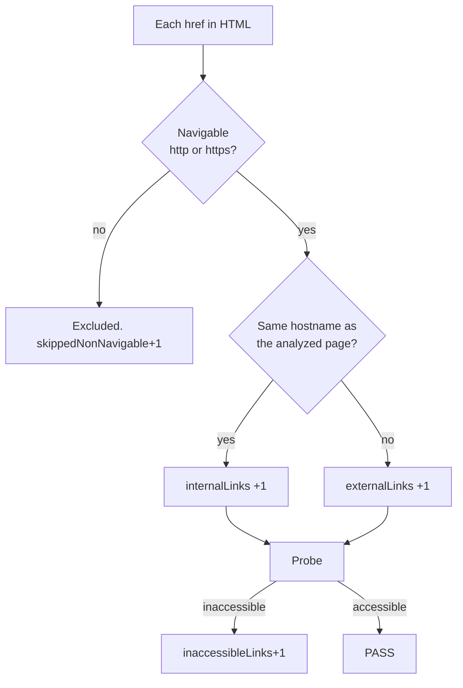
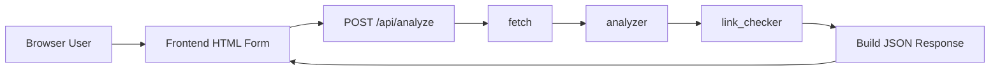
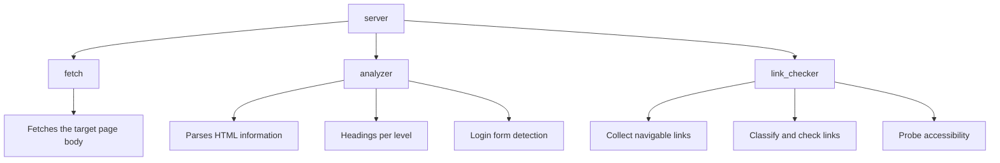

# Page Insight Tool

## Overview
A web application that fetches a web page and returns a structured analysis of:
- HTML version (e.g., HTML5, HTML 4.01)
- Page title
- Count of headings per level (h1 through h6)
- Number of internal and external links
- Count of inaccessible links
- Whether the page contains a login form

### Supported Links

- `http(s)://` URLs are supported and will be checked for accessibility.
- `mailto:`, `tel:`, `javascript:`, `#fragment`, and other non-HTTP schemes are **not** supported and will be **excluded** from all counts and accessibility checks. 

### Counting logic


## System Requirements

| Tool | Version |
|---|---|
| Go | ≥ 1.25 |
| Node.js | `>=20.19.0` or `>=22.12.0` |
| golangci-lint | v2.11 (linting only) |

## Build & Run 

```bash
# setup for the first time
cd frontend && npm install

make build
./page-insight
# Open Browserhttp://127.0.0.1:8080
```

With custom configuration

```bash
cp config.default.yaml config.yaml
./page-insight --config config.yaml
```

## Project Structure

```
cmd/main.go           — binary entrypoint
internal/
  config/             — configuration module
  httpclient/         — shared HTTP client module
  fetch/              — fetches the target page body
  analyzer/           — parses HTML information
  link_checker/       — classifies and checks links
  server/             — HTTP server
frontend/             — React SPA
```

## Architecture Overview

### High-Level Request Flow



### Component Boundaries



* The API handler orchestrates but does not implement business logic.
* Each package owns one concern -> clear boundaries
  * package isolation -> follows single-responsibility principle, easier to test
  * future proof -> each package can be scaled independently in the future.
    - analyzer only needs computation
    - link_checker needs efficient network access

## Design Decisions

### Clear Component Boundaries


* The API handler orchestrates but does not implement business logic.
* Each package owns one concern -> clear boundaries
  * package isolation -> follows single-responsibility principle, easier to test
  * future proof -> each package can be scaled independently in the future.
    - analyzer only needs computation
    - link_checker needs efficient network access
### Server + static frontend
server serves static frontend files -> no CORS handling needed

### Early exit on fetch failure

If the initial page fetch fails (network error, HTTP ≥ 400, wrong content type, or body too large), a structured error is returned and stop the pipeline.

### Redirect handling
- To avoid infinite redirect, we limit the number of redirects.
- Max redirection is configurable, default `10`
- The *final* URL after all redirects is used as the base for internal/external classification, ensuring correctness for sites that redirect `http://` → `https://`.

### Link probing logic

- **HEAD first:** each URL is probed with [HEAD](https://developer.mozilla.org/en-US/docs/Web/HTTP/Reference/Methods/HEAD) avoid downloading large pages.
- **GET fallback:** if the response is **405 Method Not Allowed** or **501 Not Implemented**, the same URL is probed again with **GET** as a fallback.
- **Inaccessible when:** 
  - the request fails (network, timeout, etc.) 
  - the final status code is **≥ 400**. 

### Concurrent link probing
- concurrent link probing is implemented with worker pool pattern using goroutines (with configurable worker count), improving effeciency in analyzation process.
- deduplication before probing reduces duplicate network requests.

### API Endpoint

`POST` was chosen over `GET` because it keeps the URL clean, supports structured JSON payloads, and scales better for additional parameters.

### Structured Response

Every response — success or failure — uses the same `{ "data": …, "error": … }` envelope -> simplifies frontend rendering and API consumers.

## Suggestions for Future Improvements
- **Dockerize the application:** Easier to deploy and manage.
- **Caching:** Cache analysis results by URL (with a short TTL) to avoid re-fetching the same page repeatedly.
- **Robots.txt respect:** Check [robots.txt](https://developers.google.com/crawling/docs/robots-txt/create-robots-txt) before probing links to avoid violating crawl policies.
- **Metrics & observability:** Expose a `/metrics` endpoint and add structured trace IDs per request for performance monitoring.

---

## Development

### Run locally

Run the Go backend and the Vite dev server in separate terminals:

```bash
# Terminal 1 — Go backend
make local

# Terminal 2 — Vite frontend
make local-frontend
# open http://localhost:5173 in your browser
```

### Testing & Linting

```bash
make test
make lint
```
