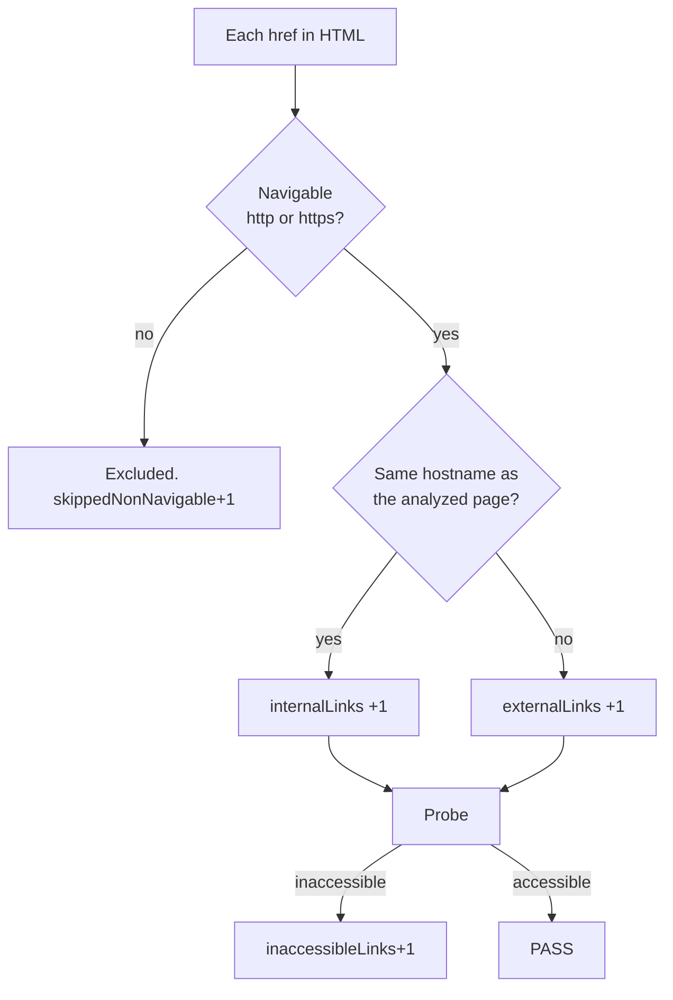
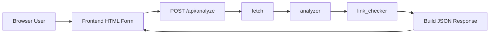
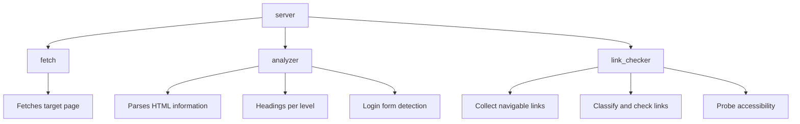

# Page Insight Tool

## Overview
A web application that fetches a web page and returns a structured analysis of:
- HTML version (e.g., HTML5, HTML 4.01)
- Page title
- Count of headings per level (h1 through h6)
- Number of internal and external links
- Count of inaccessible links
- Whether the page contains a login form

## Strength
- Single-responsibility principle for each package.
- Separated configuration from application code.
- Full CI setup with unit tests and linting.
- Strong test coverage across critical functionality.
- Efficient link detection with concurrent probing.
- Deployment-friendly with the `/health` endpoint and structured JSON logging.

## Supported Links

- `http(s)://` URLs are supported and will be checked for accessibility.
- `mailto:`, `tel:`, `javascript:`, `#fragment`, and other non-HTTP schemes are **not** supported and will be **excluded** from all counts and accessibility checks. 

## Report Counting logic


## System Requirements

| Tool | Version |
|---|---|
| Go | ≥ 1.25 |
| Node.js | `>=20.19.0` or `>=22.12.0` |
| golangci-lint | v2.11 (linting only) |

## Build & Run 

```bash
# setup for the first time
cd frontend && npm install

make build
./page-insight
# Open Browserhttp://127.0.0.1:8080
```

With custom configuration

```bash
cp config.default.yaml config.yaml
./page-insight --config config.yaml
```

## Project Structure

```
cmd/main.go           — binary entrypoint
internal/
  config/             — configuration module
  httpclient/         — shared HTTP client module
  fetch/              — fetches the target page body
  analyzer/           — parses HTML information
  link_checker/       — classifies and checks links
  server/             — HTTP server
frontend/             — React SPA
```

## Architecture Overview

### High-Level Request Flow



### Component Boundaries



* The API handler orchestrates but does not implement business logic.
* Each package owns one concern -> clear boundaries
  * package isolation -> follows single-responsibility principle, easier to test
  * future proof -> each package can be scaled independently in the future.
    - analyzer only needs computation
    - link_checker needs efficient network access

## Design Decisions
### Mono-Repository
- **Pros:** Simplifies dependency management, release management, and easier development setup.
- **Pros:** Enables shared API contract (e.g. OpenAPI) and be versioned together
- **Cons:** Can grow large over time, requiring careful organization and CI optimizations.
- **Alternatives considered:** Separate repositories for backend and frontend, This was rejected to keep the project lightweight and easier to iterate locally.

### Synchronous API Design
- **Pros:** Keeps the request pipeline simple, minimizes orchestration complexity, and makes debugging and tracing easier in the current MVP.
- **Cons:** High-link-count pages can increase latency and may expose the service to longer request durations or HTTP timeouts.
- **Alternatives considered:** Asynchronous job processing with queued work items, polling, or webhooks. This approach was deferred until the service needs higher throughput or background processing.

### Server + static frontend
- **Pros:** Simplifies deployment, and enables a single image to serve both API and UI.
- **Pros:** Same origin policy reduces the need for CORS configuration.
- **Cons:** Limits frontend deployment flexibility -> requires rebuilding the backend binary for frontend changes in production.
- **Alternatives considered:** Separate static hosting for the frontend with a standalone API service. This was not chosen because I expect the frontend to be minimal and the change would be mainly in backend.

### Early exit on fetch failure

If the initial page fetch fails (network error, HTTP ≥ 400, wrong content type, or body too large), a structured error is returned and stop the pipeline.

### Redirect handling
- To avoid infinite redirect, we limit the number of redirects.
- Max redirection is configurable, default `10`
- The *final* URL after all redirects is used as the base for internal/external classification, ensuring correctness for sites that redirect `http://` → `https://`.

### Link probing logic

- **HEAD first:** each URL is probed with [HEAD](https://developer.mozilla.org/en-US/docs/Web/HTTP/Reference/Methods/HEAD) to avoid downloading large pages.
- **GET fallback:** if the response is **405 Method Not Allowed** or **501 Not Implemented**, the same URL is probed again with **GET** as a fallback.
- **Inaccessible when:** 
  - the request fails (network, timeout, etc.) 
  - the final status code is **≥ 400**. 

### Concurrent link probing
- Concurrent link probing is implemented with a worker pool pattern using goroutines (with configurable worker count), improving efficiency in the analysis process.
- deduplication before probing reduces duplicate network requests.
- **Pros:** faster analysis on pages with many links, better CPU utilization, and less time blocked by slow remote requests.
- **Cons:** more complexity in error handling and coordination.
- **Cons:** risk of overwhelming target servers if the worker count is too aggressive.
- **Alternatives considered:** probing links sequentially. This was initially implemented but switched to concurrent probing to improve performance.

### API Endpoint

`POST` was chosen over `GET` because it keeps the URL clean, supports structured JSON payloads, and scales better for additional parameters.

### Structured Response

Every response — success or failure — uses the same `{ "data": …, "error": … }` envelope -> simplifies frontend rendering and API consumers.

## Suggestions for Future Improvements
### Web Crawling
- **JavaScript-rendered pages:** Add optional headless browser support for pages that rely on client-side rendering to produce a more accurate analysis.
- **Robots.txt and crawl etiquette:** Respect `robots.txt` directives before probing links to avoid crawling disallowed paths.
- **Login form detection:** Consider different use cases e.g. Email with OTP code, OAuth buttons, etc.
- **Rate limit:** Implement rate limiting crawling to avoid overwhelming target servers, especially for pages with many links.
- **Retrty logic:** Add retry logic with backoff for transient network errors during page fetch and link probing.

### Performance
- **Client-side result caching:** Cache analysis results keyed by URL and response validators such as `ETag`/`Last-Modified` to avoid repeated fetches for unchanged pages.
- **Server-side caching:** Implement an in-memory or Redis cache to store recent analysis results, reducing load for frequently analyzed URLs.
- **Async job processing:** Consider an asynchronous processing model for large workloads (e.g. pages with hundreds of links) to prevent HTTP timeouts and improve responsiveness.
- **Load Testing:** Implement load testing with tools e.g. k6 to evaluate performance under expected traffic scenarios.

### API & Validation
- **OpenAPI specification**: Define an OpenAPI spec for the API to provide clear documentation and enable client generation e.g. [oapi-codegen](https://github.com/oapi-codegen/oapi-codegen).
- **Request validation**: with middleware for better code organization and separation of concerns. E.g. with [go-playground/validator](https://github.com/go-playground/validator).

### Security
- **Rate limiting:** Add per-IP or global rate limiting for `/api/analyze` endpoint to prevent abuse and protect the service under load.

### Observability
- **Prometheus metrics:** Expose request counts, latency histograms, and link-check performance metrics on a `/metrics` endpoint.

---

## Development

### Run locally

Run the Go backend and the Vite dev server in separate terminals:

```bash
# Terminal 1 — Go backend
make local

# Terminal 2 — Vite frontend
make local-frontend
# open http://localhost:5173 in your browser
```

### Testing & Linting

```bash
make test
make lint
```
